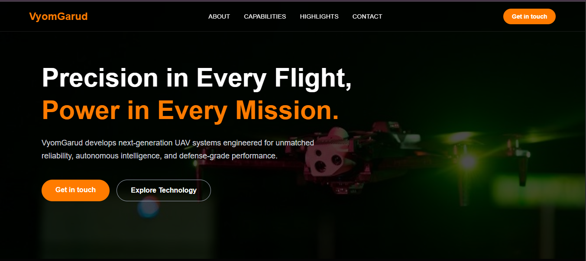
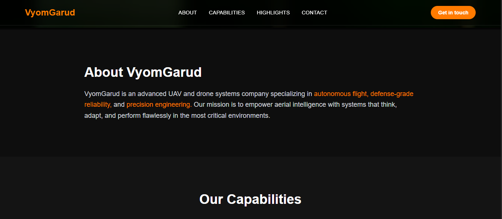
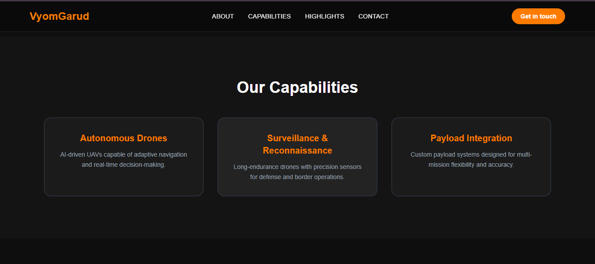
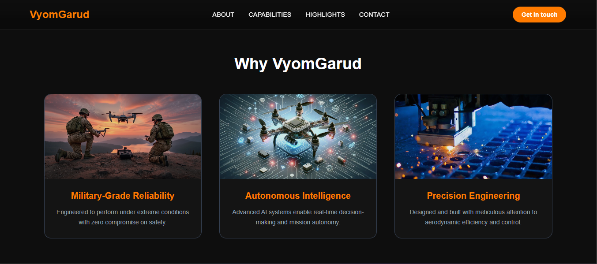
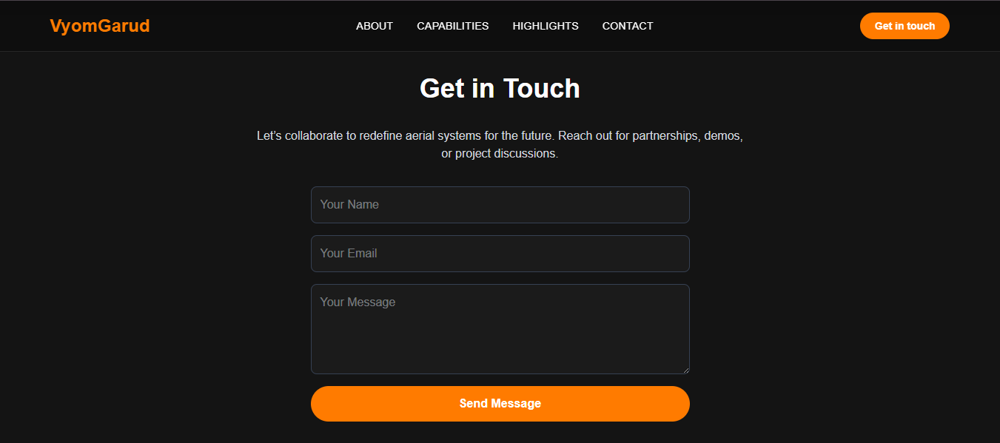

# VyomGarud – Modern UAV Landing Page

A clean, confident, and futuristic landing page built for VyomGarud, a next-generation UAV and defense technology company.
Developed using Next.js, Tailwind CSS, and Framer Motion, this website represents precision, reliability, and autonomy through a modern design and subtle animations.

## Live Preview
[https://vyomgarud-landing.vercel.app](https://vyomgarud-landing-lyart.vercel.app/)

## Overview

This landing page is designed to reflect high reliability and advanced engineering — similar in tone and style to leading technology brands like Onomondo.
It includes smooth animations, glassmorphic UI, and a cinematic hero section with a subtle parallax effect.

## Hero Section

## About Section

### Capabilities

## Highlights

## Contact Section

## Tech Stack

# Technology Purpose
    Next.js 14 (App Router) = Framework for the landing page
    Tailwind CSS = Utility-first styling
    Framer Motion = Smooth animations and parallax effects
    TypeScript (optional) = Type safety and clean code

## Design System

# Theme:

    Dark, minimal, and futuristic

# Primary Colors:

    Charcoal #0e0e0e
    White #ffffff
    Orange Accent #ff7b00

# Fonts:

    Poppins, Inter, or Montserrat

# Design Style:

    Glassmorphic Navbar
    Subtle parallax hero background
    Animated cards and section reveals
    Responsive layout for all devices

## Features

    Fixed transparent glassmorphic Navbar
    Cinematic Hero section with zoom-out parallax
    Smooth scroll navigation
    Scroll reveal animations for every section
    Animated highlight cards on hover
    Functional Contact Form (UI only)
    Fully responsive across devices

## Project Structure

    vyomgarud-landing/
    ├─ app/
    │ ├─ components/
    │ │ ├─ Reveal.tsx
    │ ├─ page.tsx
    | ├─ Navbar.tsx
    │ ├─ globals.css
    ├─ public/
    │ ├─ hero-bg.jpg
    │ ├─ reliability.jpg
    │ ├─ intelligence.jpg
    │ ├─ engineering.jpg
    ├─ screenshot/
    │ ├─ hero.png
    │ ├─ about.png
    │ ├─ capabilities.png
    │ ├─ highlights.png
    │ └─ contact.png
    ├─ package.json
    └─ tailwind.config.js

## Setup Instructions

1. Clone the Repository
   git clone https://github.com/your-username/vyomgarud-landing.git
   cd vyomgarud-landing

2. Install Dependencies
   npm install

3. Run the Development Server
   npm run dev

Then open http://localhost:3000
in your browser.

4. Build for Production
   npm run build
   npm start

## Developer Information

Created by Karan Sharma

This project demonstrates practical skills in Next.js, Tailwind CSS, Framer Motion, and modern UI/UX design principles.
